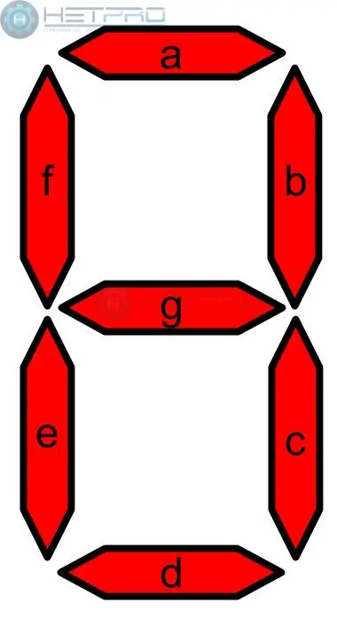

# Proyecto Tamagotchi, entrega 1

* Angela Sofia Ortiz Oliveros
* Linda Marcela Orduy Polania
* Juan David Gonzalez Muñoz
* David Santiago Cuellar Lopez

## Contenido [sección de guía eliminar despues]
Objetivo: Definición periféricos del proyecto y diseño inicial.

Esperado:

* Especificación detallada del sistema (Completo).
    - a) Detalle de la especificación de los componentes del proyecto, su descripción funcional y sistema de caja negra.
    - b) Uso de un lenguaje adecuado para describir el sistema.
    - c) Utilización de diagramas de conexión claros para describir cada módulo y especificar los bloques funcionales en HW.

* Plan inicial de la arquitectura del sistema (Solo a y b).
    - a) Definición clara de la funcionalidad de cada periférico y coherencia con la implementación en HDL y su conexión.
    - b) Capacidad para decidir la arquitectura más adecuada del proyecto y replanteamiento de modelos.
* Documentación inicial en el repositorio de Git (a y b).
    - a) Consolidación de la documentación en un repositorio de Git, incluyendo texto, imágenes y videos de los criterios anteriormente expuestos.
    - b) Organización clara y estructurada de la documentación, facilitando la comprensión del proyecto y el seguimiento del proceso.

***
## Introducción
Este proyecto se centra en la creación de un tamagotchi (mascota virtual) mediante el uso de una FPGA y diversos componentes que mejoren la visualización e interacción con el hardware que se va a crear. Se tiene planeado inicialmente utilizar una pantalla LCD de Nokia, además de los leds integrados en la tarjeta, para la visualización de la mascota y sus estados. Junto con esto se tienen diversos componentes extra como una fotorresistencia y un sensor de ultrasonido, además de los botones ya integrados en la tarjeta, que serán de ayuda para generar una mayor interacción del usuario con su mascota virtual. Todo será programado en Verilog e implementado por medio de Quartus.

***
## Diagrama de Caja Negra General

***
## Componentes

### FPGA

### HC-SR04

* Descripción Funcional

Este es un sensor ultrasónico que tiene una capacidad de detección dentro de un rango entre 0.3 a 3 metros de distancia, y tiene la siguiente descripción de pines[1]. 

Este sensor tiene 4 pines de conexión como se ve en la imagen, 

donde (de izquierda a derecha)  1 es VCC (power cathode), 2 es la entrada, 3 es la salida proporcional a la distancia (ECHO) y 4 es ground (power anode).

* Especificaciones
    - Voltaje de alimentación DC: 3V- 5V
    - Consumo de corriente en reposo: < 2mA
    - Corriente de operación : 15mA
    - Rango de detección: 2cm a 400cm ± 3mm
    - Ángulo efectivo 15º
    - Dimensiones: 45 mm x 20 mm x 15 mm

* Diagrama de Caja Negra

### LCD Nokia 5110

* Descripción Funcional:

    Es una pantalla blanco y negro usada anteriormente en los teléfonos de marca Nokia, pero que se dejó de usar por la llegada de nuevas pantallas. Esta se puede utilizar para mostrar caracteres alfanuméricos, dibujar formas e incluso mapas de bits por medio de sus 84*48 pixeles monocromáticos (84 columnas y 48 filas), esto se puede lograr mediante el método de comunicación SPI que acepta esta pantalla.Todas sus funcionalidades están almacenadas en un pequeño chip que opera a bajos voltajes.

* Especificaciones
    - Diseñado para trabajar de 2.7v a 3.3v
    - Niveles de comunicación de 3v
    - Salidas de 48 filas y 84 columnas
    - RES (reset) externo
    - Interfas serial maxima de 40 Mbits/s
    - Entradas compatibles con CMOS
    - Mux rate: 48
    - Rango de voltaje del display, 6v a 8.5v con voltaje LCD generado internamente o 6v a 9v con voltaje LCD suministrado externamente.
    - Bajo consumo, adecuado para trabajar con sistemas de baterias
    - Rango de temperatura: -25°C a +70°C

* Diagrama de Caja Negra

    

    

### Fotoresistencia

* Descripción Funcional:

    Es una resistencia que varía en función de la luz que incide sobre su superficie, cuanto mayor sea la intensidad de la luz que incide en la superficie del LDR menor será su resistencia y cuanta menos luz incida mayor será su resistencia. Para nuestro caso esto se traducirá como un 1 y un 0 dependiendo de que no supere cierto nivel de luz en su superficie.

* Especificaciones
    - Fabricado en semiconductor de alta resistencia
    - En la oscuridad, resistencia varia entre 1MΩ; bajo alta intensidad de luz, resistencia varia entre 100Ω
    - Cambio de intensidad luminica tiene una respuesta de una décima de segundo
    - De muy bajo costo y tecnología sencilla

* Diagrama de Caja Negra

### LEDS 7 Segmentos

* Descrippción Funcional

    Es un dispositivo opto-electrónico que permite visualizar números y/o letras dependiendo de lo que se requiera. De estos existen 2 tipos, el de ánodo común y el de cátodo común y como están construidos con diodos LED requiere una corriente máxima.Su estructura es estándar en cuanto al nombre de los segmentos, donde a cada uno se le asigna una letra de la "a" a la "g" como se muestra a continuación:

    

    Este funciona al activar y desactivar cada uno de los leds, formando lo que se desea visualizar al apagar y prender cada uno de los leds.

* Especificaciones
    - Voltaje de Operación Típico: 5V con el uso de Resistencias de 120 Ω.
    - Corriente de consumo por segmento: 20 mA.
    - Polaridad: Ánodo y Cátodo Común.
    - Tamaño del Display: 14 mm.
    - Color: Rojo.
    - Dimensiones: 12.6 mm x 19 mm x 8 mm

* Diagrama de Caja Negra

## Funcionamiento

### Estados

Inicialmente el Tamagotchi tendrá una serie de estados que reflejaran ciertas necesidades físicas y emocionales, como los siguientes:
* Hambre: Este estado alerta sobre la necesidad de alimentar a la mascota. La falta de atención a esta necesidad puede desencadenar un estado de enfermedad.
* Diversión: Denota la necesidad de entretenimiento de la mascota. La inactividad prolongada puede llevar a estados de ánimo bajo y la actividad ocasional mantendrá un estado de ánimo bueno.
* Energía: Identifica cuando la mascota requiere reposo para recuperarla, especialmente después de períodos de actividad intensa o durante la noche, limitando la interacción del usuario durante estas fases.
* Salud: va a niveles de enfermo por el descuido en el cuidado de la mascota, requiriendo intervenciones específicas para su recuperación.
* Ánimo: Refleja el bienestar general de la mascota como resultado de satisfacer adecuadamente sus necesidades básicas.

### Perifericos

* Botones
    - Reset: Reestablece el Tamagotchi a un estado inicial conocido al mantener pulsado el botón durante al menos 5 segundos. Este estado inicial simula el despertar de la mascota con salud óptima.
    -  Test: Activa el modo de prueba al mantener pulsado por al menos 5 segundos, permitiendo al usuario navegar entre los diferentes estados del Tamagotchi con cada pulsación.
    - Botón de Interacción (a): Alimentar a la mascota para elevar su nivel de hambre, pueden haber varios alimentos y algunos de ellos en caso tal pueden estar contaminados, disminuyendo el nivel de salud.
    - Botón de Interacción (b): Curar a la mascota para elevar su nivel de salud y evitar el empeoramiento de los demas estados.

* Pantalla LCD

En esta pantalla se mostrará a la mascota virtual y las diferentes reacciones que pueda llegar a tener dependiendo del nivel de sus estados y las interacciones que se realicen con ella.

Además esta pantalla tiene la opción de variar la "backlight" que se relacionará con el momento día o noche.

* LEDS

Los LEDS de 7 segmentos se encargarán de mostrar el nivel de cada uno de los estados con un valor que variará entre 1 y 8. Siendo 8 el estado óptimo y 1 el estado pésimo.

* Sensores

    - Sensor Fotorresistencia: cuando se cubra (no sensa luz) la mascota entrará en estado de descanso y recuperará su energía dependiendo del tiempo de reposo, en este modo no interactuará con nosotros de ninguna manera hasta que se descubra (sensa luz nuevamente) donde estará activa y lista para interactuar nuevamente.
    - Sensor Ultrasonido: dependiendo de si hay un obstaculo o no en el rango de visión del sensor, la mascota lo tomará como un obstaculo a saltar que aumentará su nivel de diversión, permitiendonos simular un juego con ella.

## Mascota 

Se escogió un conejo como el avatar/mascota del tamagotchi y se diseñó usando pixeles para facilitar su ṕosterior implementación en código. 

 

## Conexión Sistema

# Referencias
[1] “HC-SR04 Ultrasonic Sensor Module User Guide,” *HandsOnTech*. https://www.handsontec.com/dataspecs/HC-SR04-Ultrasonic.pdf

[2]“Nokia5110 LCD Module,” *Microcontrollers Lab*, Ene. 28, 2020. https://microcontrollerslab.com/nokia5110-lcd-pinout-arduino-interfacing-datasheet/ 

[3]Philips Semiconductors, “PCD8544 Datasheet ,” *Sigma Electronica*, Abr. 12, 1999. https://www.sigmaelectronica.net/manuals/NOKIA%205110.pdf 

https://ferretronica.com/products/sensor-de-movimiento-pir-hc-sr501

https://www.sigmaelectronica.net/producto/nokia-5110/

http://ceca.uaeh.edu.mx/informatica/oas_final/red4_arduino/fotorresistencia.html
