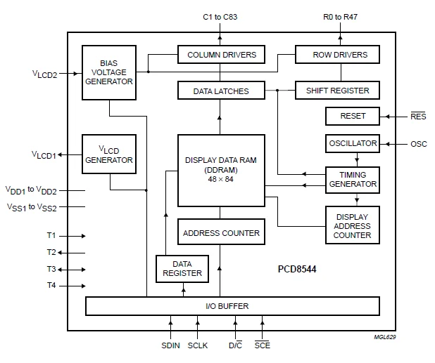
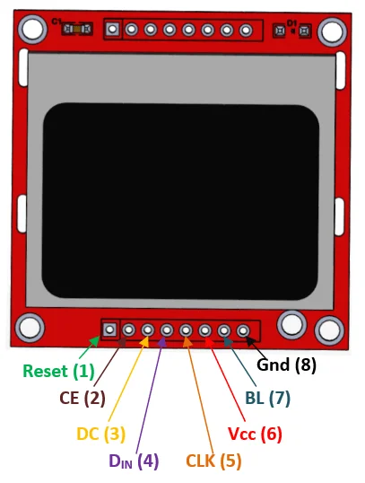

# Proyecto Tamagotchi, entrega 1

* Angela Sofia Ortiz Oliveros
* Linda Marcela Orduy Polania
* Juan David Gonzalez Muñoz
* David Santiago Cuellar Lopez

## Contenido [sección de guía eliminar despues]
Objetivo: Definición periféricos del proyecto y diseño inicial.

Esperado:

* Especificación detallada del sistema (Completo).
    - a) Detalle de la especificación de los componentes del proyecto, su descripción funcional y sistema de caja negra.
    - b) Uso de un lenguaje adecuado para describir el sistema.
    - c) Utilización de diagramas de conexión claros para describir cada módulo y especificar los bloques funcionales en HW.

* Plan inicial de la arquitectura del sistema (Solo a y b).
    - a) Definición clara de la funcionalidad de cada periférico y coherencia con la implementación en HDL y su conexión.
    - b) Capacidad para decidir la arquitectura más adecuada del proyecto y replanteamiento de modelos.
* Documentación inicial en el repositorio de Git (a y b).
    - a) Consolidación de la documentación en un repositorio de Git, incluyendo texto, imágenes y videos de los criterios anteriormente expuestos.
    - b) Organización clara y estructurada de la documentación, facilitando la comprensión del proyecto y el seguimiento del proceso.

## Sistema de sensado
Se escogieron dos sensores
* Sensor de luz: una fotoresistencia que detecta/simula el día o la noche para la mascota. 

* Sensor de movimiento: *definir que hace*

Este es un sensor PIR (passive infrared), se escogió la referencia HC-SR501. El cual tiene una capacidad de deteccion dentro de un cono de 110° entre 3 a 7 metros de distancia, y tiene la siguiente descripción de pines[1]. 

Y LINKS 

## Sistema de visualización 
Se eligieron does maneras de visualización:
* Display 7 segmentos : *describir que mostraria*
* Pantalla LCD: se eligió la referencia Nokia 5110, que tiene un tamaño de 84x84 pixeles y usa el protocolo SPI, el diagrama de bloques del controlador es el siguiente [2]:

Además su descricpcion de pines es esta:

# Referencias
[1]  “HC--SR501,” *Electronilab*. https://electronilab.co/wp-content/uploads/2013/12/HC-SR501.pdf

[2]“Nokia5110 LCD Module,” *Microcontrollers Lab*, Ene. 28, 2020. https://microcontrollerslab.com/nokia5110-lcd-pinout-arduino-interfacing-datasheet/ 

[3]“HC-SR501 Passive Infrared (PIR) Motion Sensor”. https://www.epitran.it/ebayDrive/datasheet/44.pdf

[4]Philips Semiconductors, “PCD8544 Datasheet ,” *Sigma Electronica*, Abr. 12, 1999. https://www.sigmaelectronica.net/manuals/NOKIA%205110.pdf 