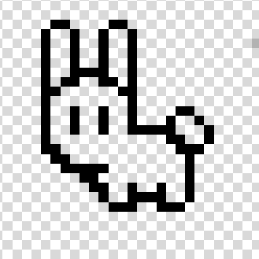

# Proyecto Tamagotchi, entrega 1

* Angela Sofia Ortiz Oliveros
* Linda Marcela Orduy Polania
* Juan David Gonzalez Muñoz
* David Santiago Cuellar Lopez

***
## Introducción

Este proyecto se centra en la creación de un tamagotchi (mascota virtual) mediante el uso de una FPGA y diversos componentes que mejoren la visualización e interacción con el hardware que se va a crear. Se tiene planeado inicialmente utilizar una pantalla LCD de Nokia para la visualización de la mascota y sus estados, junto con esto se tienen diversos componentes extra como una fotorresistencia y un sensor de ultrasonido, además de los botones ya integrados en la tarjeta, que serán de ayuda para generar una mayor interacción del usuario con su mascota virtual. Todo será programado en Verilog e implementado por medio de Quartus.

***
# Componentes

## Sensor de ultrasonido HC-SR04

_Este es un sensor ultrasónico que tiene una capacidad de detección dentro de un rango entre 0.3 a 3 metros de distancia, y tiene la siguiente descripción de pines[1]._

* Especificación

   * Detalles
        - Voltaje de alimentación DC: 3V- 5V
        - Consumo de corriente en reposo: < 2mA
        - Corriente de operación : 15mA
        - Rango de detección: 2cm a 400cm ± 3mm
        - Ángulo efectivo 15º
        - Dimensiones: 45 mm x 20 mm x 15 m

Este sensor tiene 4 pines de conexión como se ve en la imagen, donde (de izquierda a derecha) 1 es VCC (power cathode), 2 es la entrada, 3 es la salida proporcional a la distancia (ECHO) y 4 es ground (power anode).

* Descripción Funcional
A fin de crear una experiencia de usuario más inmersiva, se buscará integrar el tamagotchi con el entorno real inicialmente por medio del sensor de ultraosonido  HCRS04, con el cual el tamagotchi podrá jugar interpretando las proximidades como obstáculos por los cuales tiene que saltar, permitiendo simular un juego con la mascota y asi aumentar su nivel de diversión. 

Con el fin de desarrollar esto, se utiliza el contador de la FPGA para generar un pulso de duración específica (típicamente de 10 microsegundos) en el pin Trigger, posteriormente, aunque no de forma inmediata, el pin Echo se mantiene en alto mientras el sensor está recibiendo el eco. El ancho de pulso de esta señal es proporcional a la distancia al objeto.

* Sistema de Caja Negra

## Pantalla LCD Nokia 5110

_Es una pantalla blanco y negro usada anteriormente en los teléfonos de marca Nokia. Esta se puede utilizar para mostrar caracteres alfanuméricos, dibujar formas e incluso mapas de bits por medio de sus 84*48 pixeles monocromáticos (84 columnas y 48 filas), esto se puede lograr mediante el método de comunicación SPI que acepta esta pantalla._

* Especificaciones

    * Detalles
        - Diseñado para trabajar de 2.7v a 3.3v
        - Niveles de comunicación de 3v
        - Salidas de 48 filas y 84 columnas
        - RES (reset) externo
        - Interfas serial maxima de 40 Mbits/s
        - Entradas compatibles con CMOS
        - Mux rate: 48
        - Rango de voltaje del display, 6v a 8.5v con voltaje LCD generado internamente o 6v a 9v con voltaje LCD suministrado externamente.
        - Bajo consumo, adecuado para trabajar con sistemas de baterias
        - Rango de temperatura: -25°C a +70°C    

* Descripción Funcional 

En esta pantalla se mostrará a la mascota virtual así como las diferentes reacciones que pueda llegar a tener dependiendo del nivel de sus estados y las interacciones que se realicen con ella. Además esta pantalla tiene la opción de variar la "backlight" que se relacionará con el periodo de día o noche.

La pantalla LCD Nokia 5110 tiene un área de visualización adecuada para el tamagotchi, lo que permite mostrar más contenido simultáneamente y permitirá una interfaz de usuario más intuitiva y con mayor información al mostrar los niveles de estado en pantalla directamente.

* Sistema de Caja Negra

## Sensor de luz con Fotorresistencia

_La fotorresistencia una resistencia que varía en función de la luz que incide sobre su superficie, cuanto mayor sea la intensidad de la luz que incide en la superficie del LDR menor será su resistencia y cuanta menos luz incida mayor será su resistencia. El voltaje de salida digital es un “0” lógico cuando la intensidad de luz excede el valor fijado por el potenciómetro y es un “1” lógico cuando sucede lo contrario. El voltaje de salida analógico simplemente aumenta o disminuye de acuerdo al aumento o disminución de intensidad de luz, respectivamente._

* Especificaciones

    * Detalles
        - Voltaje de alimentación DC: 3.3V a 5V
        - Utiliza el integrado LM393
        - Utiliza Fotoresistencia GL5528
        - En la oscuridad, resistencia varia entre 1MΩ; bajo alta intensidad de luz, resistencia varia entre 100Ω
        - Cambio de intensidad luminica tiene una respuesta de una décima de segundo
        - Salida: Digital y Analógica
        - Sensibilidad ajustable con potenciómetro

* Descripción Funcional

Se usará un sensor de luz para determinar cuando la mascota podrá descansar. Siempre que el sensor detecte luz se podrá realizar el resto de funciones con normalidad menos la de descansar o dormir y cuando el sensor no detecte luz este enviara una señal para que la mascota virtual pueda descansar y así reponer su nivel de energía con el tiempo.

* Sistema de Caja Negra

# Arquitectura del Sistema

## Funcionamiento

### Estados

Inicialmente el Tamagotchi tendrá una serie de estados que reflejaran ciertas necesidades físicas y emocionales, como los siguientes:

* Hambre: Indica la necesidad de alimentar a la mascota. 
  - La falta de atención a esta necesidad puede disminuir el estado de Salud.
* Diversión: Indica la necesidad de entretenimiento de la mascota. 
  - La inactividad prolongada puede disminuir el estado de Animo.
  - La actividad ocasional mantendrá un estado de Animo óptimo y de vez en cuando disminuira el estado de Energía.
* Energía: Indica cuando la mascota requiere reposo para recuperar energía.
  - EL estado de Energía disminuye después de períodos de actividad intensa o si se mantiene despierta a la mascota durante el periodo de noche.
  - El bajo nivel del estado de Energía disminuye el estado de Salud de la mascota.
* Salud: Refleja el cuidado general de la mascota.
  - Puede disminuir por el bajo nivel del estado de Hambre y de Energía de la mascota.
  - Cuando es bajo se requieren intervenir para su recuperación.
  - Un estado de Salud igual a 1 indica el fin del juego.
* Ánimo: Refleja el bienestar general de la mascota.
  - Aumenta y se mantiene en niveles óptimos al mantener los demás estados en niveles altos.

### Perifericos

* Botones

    - Reset: Reestablece el Tamagotchi a un estado inicial conocido al mantener pulsado el botón durante al menos 5 segundos. Este estado inicial simula el despertar de la mascota con sus estados óptimos.
    -  Test: Activa el modo de prueba al mantener pulsado el botón durante al menos 5 segundos, permitiendo al usuario navegar entre los diferentes estados del Tamagotchi con los botones de interacción.
    - Botón de Interacción (a): Alimentar a la mascota aumenta su estado de Hambre, pueden haber varios alimentos y algunos de ellos pueden estar contaminados, disminuyendo el estado de Salud.
    - Botón de Interacción (b): Curar a la mascota aumenta su estado de Salud y evita el empeoramiento de los demas estados.

### Mascota

Se escogió un conejo como el avatar/mascota del tamagotchi y se diseñó usando pixeles para facilitar su ṕosterior implementación en código. Este es el diseño principal y sobre el cual se basaran las interacciones de la mascota.

 

## Caja Negra General

# Referencias
[1] “HC-SR04 Ultrasonic Sensor Module User Guide,” *HandsOnTech*. https://www.handsontec.com/dataspecs/HC-SR04-Ultrasonic.pdf

[2]“Nokia5110 LCD Module,” *Microcontrollers Lab*, Ene. 28, 2020. https://microcontrollerslab.com/nokia5110-lcd-pinout-arduino-interfacing-datasheet/ 

[3]Philips Semiconductors, “PCD8544 Datasheet ,” *Sigma Electronica*, Abr. 12, 1999. https://www.sigmaelectronica.net/manuals/NOKIA%205110.pdf 

[4] UAEH, “Fotorresistencia ,” *Arduino UAEH*, 2021. http://ceca.uaeh.edu.mx/informatica/oas_final/red4_arduino/fotorresistencia.html
