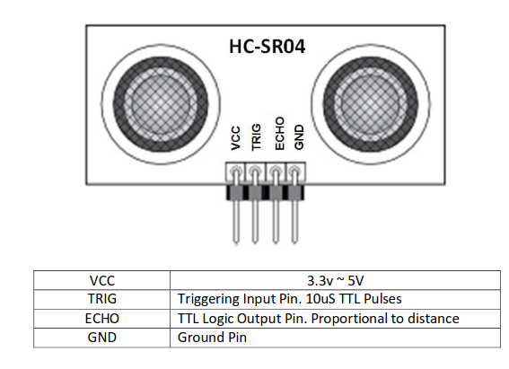
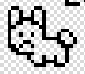

# Proyecto Tamagotchi

* Angela Sofia Ortiz Oliveros
* Linda Marcela Orduy Polania
* Juan David Gonzalez Muñoz
* David Santiago Cuellar Lopez

***

# Video Tamagotchi

[](https://www.youtube.com/watch?v=S2Y6nbKYhNk)


# Introducción

Este proyecto se centra en la implementación de un tamagotchi (mascota virtual) mediante el uso de una FPGA y diversos componentes que mejoren la visualización e interacción con el hardware que se va a crear. Se utilizará una pantalla LCD de Nokia para la visualización de la mascota y sus diversos estados, junto con esto se tienen diversos periféricos extra como un sensor de luz y un sensor de ultrasonido, además de los botones ya integrados en la tarjeta y algunos extra, que serán de ayuda para generar una mayor interacción del usuario con su mascota virtual. Todo será programado en Verilog e implementado por medio de Quartus.

# Especificación detallada del sistema

Especificación de los componentes del proyecto, con los detalles necesarios y la función que cumplen en el proyecto.

| Componente  | Especificación | Funcionamiento|
| ------------- | ------------- | ------------- |
| Botón Curar  | Pulsador FPGA  | MODO NORMAL: Cada que se oprima, aumentará el estado de Health. Tendrá un tiempo de recuperación y visualización en la pantalla. MODO TEST: Cada que se oprima, disminuirá el estado seleccionado con Botón Cambio Estado. |
| Botón Alimentar | Pulsador FPGA  | MODO NORMAL: Cada que se oprima, aumentará el estado de Food. Tendrá un tiempo de recuperación y visualización en la pantalla. MODO TEST: Cada que se oprima, aumentará el estado seleccionado con Botón Cambio Estado. |
| Botón Reset | Pulsador FPGA  | Cuando esté presionado por 5 segundos, se restablecerá el estado inicial del tamagotchi (todos los niveles igual a 5). |
| Botón Test| Pulsador FPGA  | Cuando esté presionado por 5 segundos, permitirá modificar directamente los estados haciéndolos aumentar o disminuir. Esto se podrá hacer mediante el uso de los botones Cambio Estado, Alimentar y Curar. Tendrá visualización en la pantalla mientras se encuentre en ese estado. |
| Botón Cambio Estado  | Pulsador adicional  | Solo funcionará en modo test y cada que se oprima, cambiara el estado que puede afectar. |
| Sensor de Ultrasonido | Sensor HC-SR04 | Cuando detecte una proximidad, la mascota aumentará su estado de Fun, simulando un juego. Tendrá un tiempo mínimo de interacción y visualización en la pantalla. |
| Sensor de Luz | FOTOCELDA LDR | Cuando no le entre luz, la mascota aumentará su estado de Sleep, simulando un periodo de sueño. Tendrá un tiempo mínimo de interacción y visualización en la pantalla. |
| Pantalla | LCD Nokia 5110 | Será la visualización principal, se mostrarán los valores de estado del tamagotchi, su estado actual y las interacciones que realicen con él. |
| Leds 7 segmentos | Ánodo | Se utilizará para conocer el estado en el cual se encuentra el Botón Cambio Estado. |
| FPGA | A-C4E6 Cyclone IV FPGA EP4CE6E22C8N | Controlador de las distintas operaciones que se desean hacer (contiene componentes lógicos programables). |

## Sistema de botones 

Para los 2 botones principales de interacción, alimentar y curar, se utiliza el modulo “debounce”, el anti-rebote evita que el circuito detecte múltiples pulsaciones de un botón cuando solo se presiona una vez debido al ruido eléctrico. Para el diseño de este apartado, se baso en la siguiente esquema: 

<div align="center">
	
</div>


Donde se usaron 2 flip-flops tipo D, el primero de ellos captura el primer flanco de subida de botón después de que el rebote haya cesado, generando un pulso único. En el siguiente flanco de subida de reloj, el estado de Q1 se transfiere a Q2, esto introduce un pequeño retardo adicional, asegurando que cualquier rebote residual haya desaparecido. Finalmente tenemos una compuerta AND que generará una salida alta cuando Q2 esté en alto y Q2' esté en bajo, lo que ocurre solo una vez por pulsación válida del botón.

<div align="center">
	
</div>

La implementación de un reloj lento o “Slow Clock” es importante ya que reduce la sensibilidad a los rebotes rápidos, como podemos apreciar en el testbench cuando “pb” genera varios pulsos, solo se genera un pulso de salida en out_signal

<div align="center">
	
</div>

Por otro lado, para los botones faltantes, Reset y Test, se uso un contador con el fin de que la señal de salida quede en alta solamente despues de 5 segundos y se usaron 2 flip-flops tipo D nuevamente para poder reducir la señal a 2 ciclos de reloj 

<div align="center">
	
</div>

### Sensor de ultrasonido HC-SR04

_Este es un sensor ultrasónico que tiene una capacidad de detección dentro de un rango entre 0.3 a 3 metros de distancia, y tiene la siguiente descripción de pines._

<div align="center">
	
</div>

Se utiliza el contador de la FPGA para generar un pulso de duración específica (típicamente de 10 microsegundos) en el pin Trigger, posteriormente, aunque no de forma inmediata, el pin Echo se mantiene en alto mientras el sensor está recibiendo el eco. El ancho de pulso de esta señal es proporcional a la distancia al objeto.

* Sistema de Caja Negra

<div align="center">
	
</div>

### Pantalla LCD Nokia 5110

_Es una pantalla blanco y negro usada anteriormente en los teléfonos de marca Nokia. Tiene 84*48 píxeles monocromáticos (84 columnas y 48 filas) para visualización, se realizará la conexión mediante el método de comunicación SPI que acepta esta pantalla._

<div align="center">
	
</div>

En esta pantalla se mostrará a la mascota virtual así como las diferentes reacciones que pueda llegar a tener dependiendo del nivel de sus estados y las interacciones que se realicen con ella. Los niveles de los estados tendrán una escala de 1 a 5 y se verán reflejados en la pantalla como barras.

* Sistema de Caja Negra

<div align="center">
	
</div>

### Sensor de luz con Fotorresistencia

_Resistencia que varía en función de la luz que incide sobre su superficie, cuanto mayor sea la intensidad de la luz que incide menor será su resistencia y cuanta menos luz incida mayor será su resistencia. El voltaje de salida digital es un “0” lógico cuando la intensidad de luz es alta y es un “1” lógico cuando sucede lo contrario._

<div align="center">
	
</div>

Se usará un sensor de luz para determinar cuando la mascota podrá descansar. Cuando el sensor no detecte luz este enviara una señal, después de un tiempo, para que la mascota virtual pueda descansar y así aumentar su nivel Sleep.

* Sistema de Caja Negra

<div align="center">
	
</div>

# Arquitectura del Sistema

## Estados

La máquina de estados, funcionará en ciclos de 90 segundos para aumentar o disminuir los valores de los estados.

El Tamagotchi tendrá una serie de estados que reflejaran ciertas necesidades físicas y emocionales, como los siguientes:

| Estado | Descripción | Consecuencia Health |
| ------------- | ------------- | ------------- |
| Food | Cada que pasen 30, 60 o 90 segundos, se disminuye Food. Si se obtiene la señal que indica Alimentar, se aumenta Food. | Si food es menor a 3, cada que pasen 20, 55 o 85 segundos, se disminuirá Health. |
| Sleep | Cada que pasen 18, 49 o 86 segundos, se disminuye Sleep. Si se obtiene la señal que indica Dormir, se aumenta Sleep. | Si Sleep es menor a 3, cada que pasen 34 o 75 segundos, se disminuirá Health. |
| Fun | Cada que pasen 25, 50, 73, o 89 segundos, se disminuye Fun. Si se obtiene la señal que indica Diversión, se aumenta Fun. | Si Fun es menor a 3, cada que pasen 33 o 77 segundos, se disminuirá Health. |
| Happy | Cada que pasen 23, 47, 69 o 83 segundos, sí se tiene que Food y Fun son menores que 3, se disminuye Happy. Cada que pasen 22 o 70 segundos, sí se tiene que Food y Fun son mayores que 3, se aumenta Food. | Si Happy es menor a 3, cada que pasen 2, 32 o 62 segundos, se disminuirá Health. |
| Health | Sí se obtiene la señal de curar, se aumentará Health. | _No se altera_|

## Diagrama de Máquina de Estados (FSM)

<div align="center">
	
</div>

Se decidió realizar 5 máquinas de estados que operan de manera paralela cada una con sus propias señales. Estas señales cambian dependiendo del tiempo y de condiciones predefinidas, los estados de cada una de las máquinas se dividen entre los estados que disminuyen el valor del estado de la mascota, los que lo aumentan y los que disminuyen Health.

Los estados de los valores de estado de la mascota son los siguientes:

#### Food (comida)
* IDLEFOOD: inicializa los valores en 0.
* HUNGER: disminuye el valor de Food si han pasado los segundos necesarios.
* FEED: aumenta el valor de Food si se ha recibido la señal de alimentar.
* STARVE: disminuye el valor del estado de Health si han pasado los segundos necesarios.
#### Sleep (descanso)
* IDLESLEEP: inicializa los valores en 0.
* TIRED: disminuye el valor de Sleep si han pasado los segundos necesarios.
* REST: aumenta el valor de Sleep si se ha recibido la señal de dormir.
* INSOMNIA: disminuye el valor del estado de Health si han pasado los segundos necesarios.
#### Fun (diversión)
* IDLEFUN: inicializa los valores en 0.
* BOREDOM: disminuye el valor de Fun si han pasado los segundos necesarios.
* PLAY: aumenta el valor de Fun si se ha recibido la señal del ultrasonido.
* DEPRESSION: disminuye el valor del estado de Health si han pasado los segundos necesarios.
#### Happy (animo)
* IDLEHAPPY: inicializa los valores en 0.
* SAD: disminuye el valor de Happy si han pasado los segundos necesarios y las varaibles Food o Fun son menores a 4.
* JOLLY: aumenta el valor de Happy si han pasado los segundos necesarios y las varaibles Food y Fun son mayores a 3.
* SADNESS: disminuye el valor del estado de Health si han pasado los segundos necesarios.
#### Health (salud)
* IDLEHEALTH: inicializa los valores en 0.
* HEAL: aumenta el valor de Health si se ha recibido la señal de curar.

## Testbench Maquina de estados

El código de la máquina de estados se encuentra en la carpeta FSMs y como se explicó anteriormente, son 5 máquinas de estados que funcionan paralelamente donde el estado en común de todas es cuando Health es igual a 0, cuando esto ocurre todos los demás valores de estados se vuelven 0. 

Este código tiene su testbench adjunto que en modo normal funciona de la siguiente manera:

### Modo Normal

<div align="center">
	
</div>

Pasado cierto tiempo algunos valores de estados irán disminuyendo su valor, si algunos de esos valores están por debajo de niveles predefinidos con anterioridad y luego de pasado cierto tiempo, disminuirán el valor del estado Health.

### Modo Test

<div align="center">
	
</div>

Al entrar en modo test, la función de disminución de valores de estado al paso del tiempo se detiene y se permite modificar los valores cambiando la variable de change_state, para indicar cuál valor de estado se desea modificar y con las variables de feeding y healing (alimentar y curar) se aumentará y disminuirá el valor seleccionado.

## Caja Negra General

<div align="center">
	
</div>

## Visualización 

La pantalla NOKIA 5110 utiliza el protocolo SPI, para comunicarse con ella se utilizan dos archivos principales llamados master y config: 

* Master: se encarga de "separar" el mensaje y enviarlo bit pot bit a la pantalla Nokia, también se encarga del reloj secundario, el cuál es necesario pues la frecuencia de la pantalla es de máximo 4MHz, mientras que la FPGA opera a 50MHz.

  
* Config: este tiene las secuencias necesarias para dibujar cada diseño (como iconos, la mascota, etc), utiliza la señal de control `avail` del master para enviar un nuevo mensaje, también controla la señal D/C (data/comando) que es 0 para un comando (como configuración o posición) y 1 para un mensaje a escribir (dibujar en pantalla). A su vez, este se comunica con la maquina de estados principal con la señal de control `done`, que es 0 mientras se dibuja una secuencia y 1 cuando finaliza.


Para dibujar se usa un direccionamiento horizontal, dibujando 8 pixeles a la vez de manera vertical en una dirección que va de 0 a 84 horizontalmente, también se puede posicionar en cualquiera de las 5 filas. Así, luego de dibujar una línea, la siguiente se dibuja a la derecha automáticamente. 

[](fig)
[](fig)

Dentro del código de este archivo, cada diseño es un caso, dentro del primer caso a su vez esta el caso con las secuencias de los diseños inciales (iconos, conejo) estos se dibujan de manera secuencial al iniciar o reiniciar el tamagotchi.

[](fig)

Además, se tiene un estado transitorio, llamado `STANDBY` donde se ubica luego de terminar un diseño (`done=1`) en este estado se lee la entrada del diseño a dibujar, proveniente de la maquina de estados.

```verilog
STAND_BY: begin 
  count<=4'h0;
  if(sketch != draw) sketch<=draw;
end
```


* Conexión con la maquina de estados: usando `done` como señal de control, se envía el número del diseño a dibujar, y se dibuja de mánera cíclica:
  * Barras: muestran los niveles de estados de 1-5.
    * Pera: alimento.
    * Nube: descanso.
    * Corazon: salud.
    * Juego: diversión.
    * Carita feliz: animo.
  * Caritas: según los niveles de los estados, está la carita feliz, neutra, triste o muerta. 
  * Iconos: aparecen según las acciones o interacciones que se realizan con la mascota.
    *  Zanahoria: alimentar.
    *  Cruz: sanar.
    *  Zzz: descansar/dormir.
    *  Estrella: jugar.
   
  Además, se tiene un icono T que indica si se está en modo test, y una función de limpieza parcial que limpia los iconos en pantalla antes de dibujar uno nuevo.

  [](fig)

[](fig)
[](fig)
[](fig)
[](fig)

### Simulaciones

* Simulación master: se simulo el envio del mensaje hexadecimal A3 (1010 0011 en binario) y se puede evidenciar que sale a la pantalla por medio de `mosi` bit por bit en cada flanco positivo del reloj secundario (`sclock`), además al temrinar los 8 bits se tiene la señal de `avail` activa durante un ciclo de reloj (reloj de la FPGA).

[](fig) 

* Simulación config: Se prueba el envio incicial y la transición a diseños desde una entrada, se puede ver que luego de la señal de done (al final de dibujar la mascota), se empiezan a dibujar las barras de nivel (`draw=4'h1` ), según los niveles dados como entrada. 

[](fig)

* Simulación con maquina de estados (sin sensores): Se puede ver que las barritas se dibujan adecuadamente según los niveles dados, también la carita adecuada (feliz con número 4'h8), y el icono para la interacción, para esta simulación se usó `feeding=1` que representa darle alimento a la mascota (icono de zanahoria con 4'h2). 

[](fig)
[](fig)
 
			

# Referencias
[1] “HC-SR04 Ultrasonic Sensor Module User Guide,” *HandsOnTech*. https://www.handsontec.com/dataspecs/HC-SR04-Ultrasonic.pdf

[2]“Nokia5110 LCD Module,” *Microcontrollers Lab*, Ene. 28, 2020. https://microcontrollerslab.com/nokia5110-lcd-pinout-arduino-interfacing-datasheet/ 

[3]Philips Semiconductors, “PCD8544 Datasheet ,” *Sigma Electronica*, Abr. 12, 1999. https://www.sigmaelectronica.net/manuals/NOKIA%205110.pdf 

[4] UAEH, “Fotorresistencia ,” *Arduino UAEH*, 2021. http://ceca.uaeh.edu.mx/informatica/oas_final/red4_arduino/fotorresistencia.html
